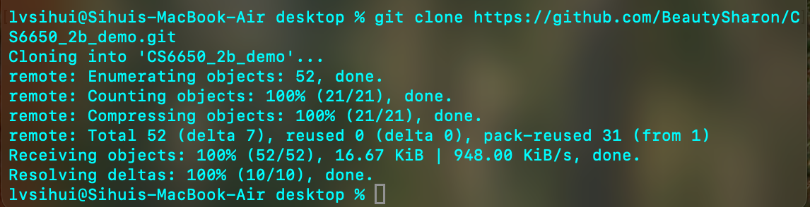
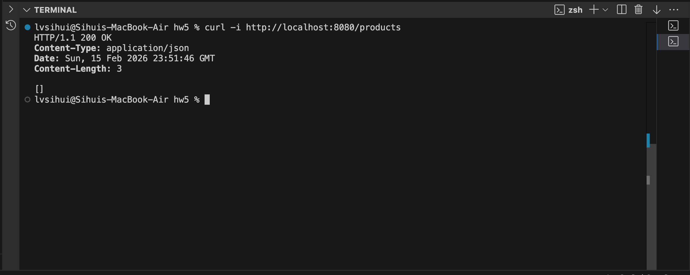
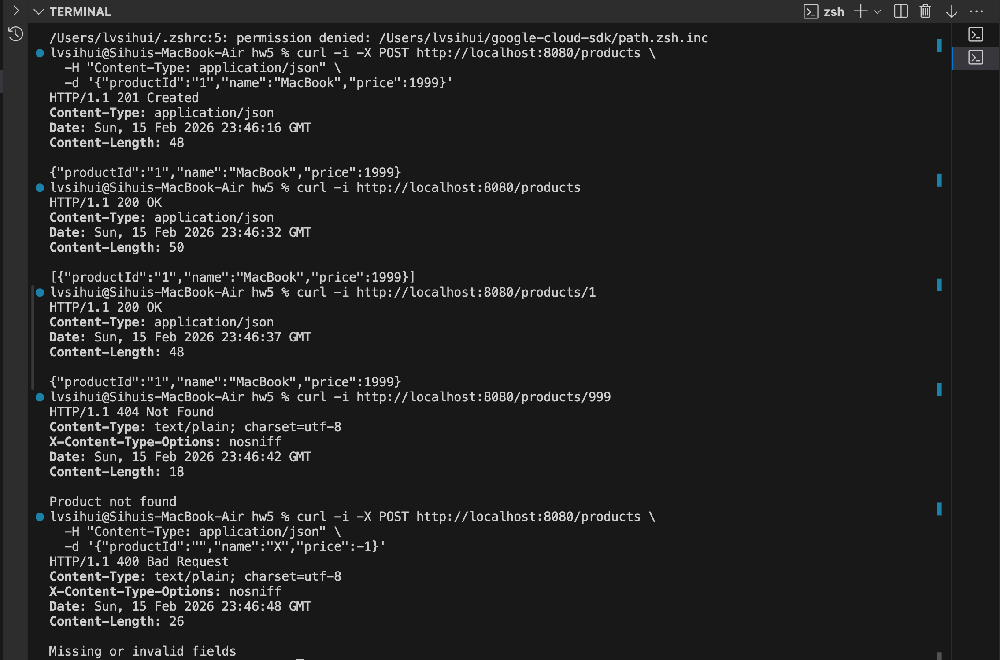
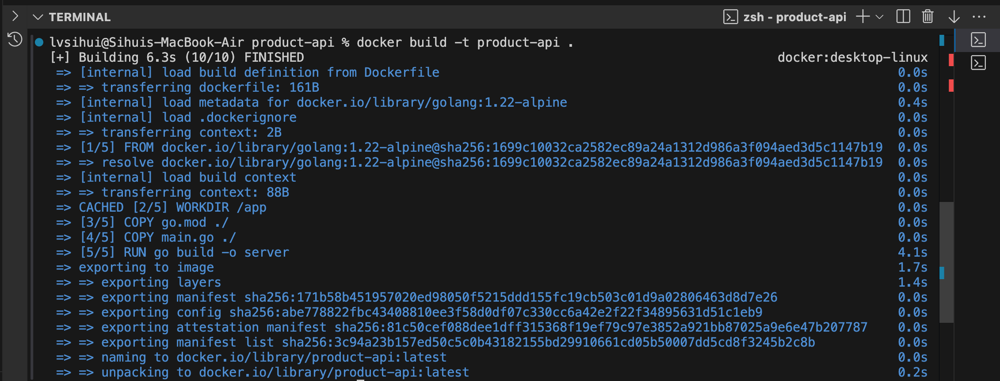
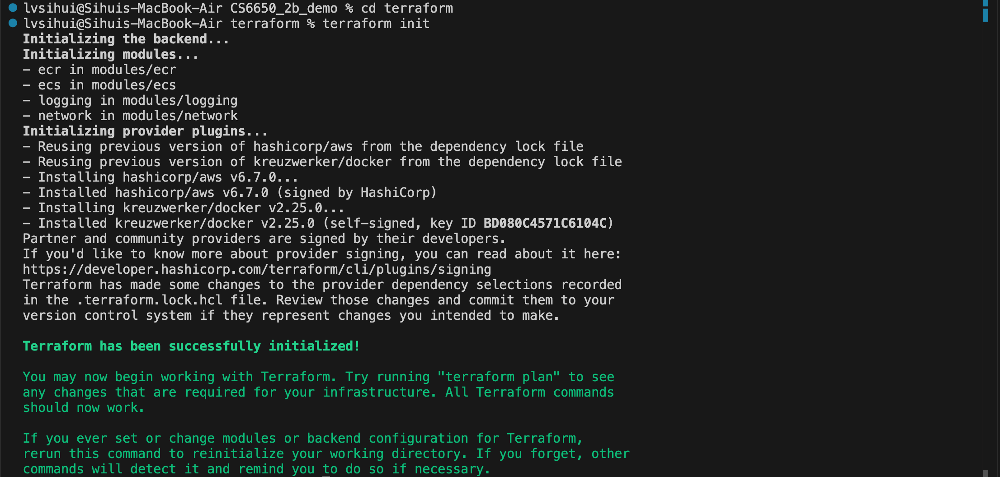
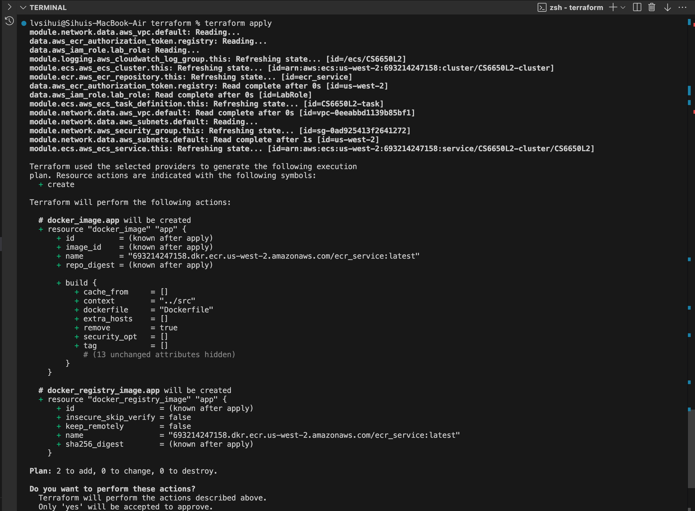
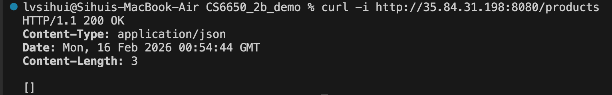
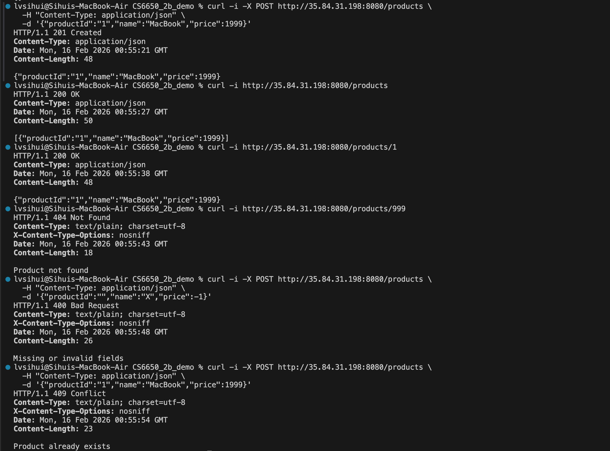
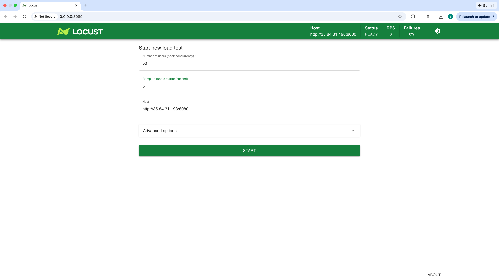
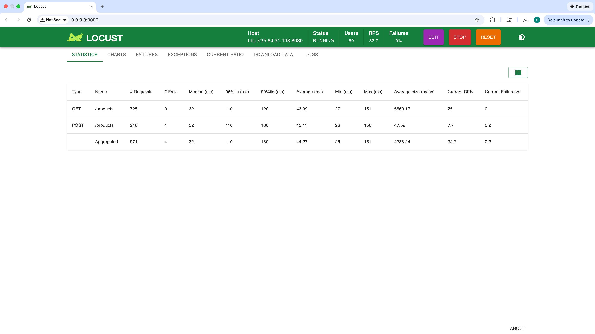

# CS6650 – HW5

## Overview

In this assignment, we implemented a Product API based on the provided OpenAPI specification and deployed it to AWS using Docker, ECR, ECS, and Terraform.

The API supports:

- POST /products
- GET /products
- GET /products/{id}

Products are stored in memory using a Go hashmap.

The infrastructure is fully automated using Terraform.

---

# Architecture

Local Development → Docker → ECR → ECS (Fargate) → Public IP Access

Components:

- Go Web Server
- Docker container
- AWS ECR (image registry)
- AWS ECS (Fargate)
- CloudWatch logging
- Terraform for Infrastructure as Code

---

# How to Deploy on a New Machine

## Step 1 – Clone the repository



---

## Step 2 – Local Test




## Step 3 – Build Docker Image (Local Test)



## Step 4 – Configure AWS Credentials

## Step 5 – Deploy Infrastructure with Terraform




---

## Step 6 – Access the API

Use the public IP from Terraform output: http://35.84.31.198:8080



---

### API Examples

### POST /products

curl -i -X POST http://35.84.31.198:8080/products \
-H "Content-Type: application/json" \
-d '{"productId":"1","name":"MacBook","price":1999}'

Expected: HTTP/1.1 201 Created

---

### GET /products

curl -i http://35.84.31.198:8080/products

Expected: HTTP/1.1 200 OK

---

### GET /products/{id}

curl -i http://35.84.31.198:8080/products/1

Expected: HTTP/1.1 200 OK

---

### Error Cases

404 Not Found – product does not exist  
400 Bad Request – invalid input  
409 Conflict – duplicate product

---

## 6.Load Testing with Locust

Test configuration:



- 50 concurrent users
- Spawn rate: 5 users/sec

Results:

  
  
- Average RPS: ~32.7
- Average response time: ~44 ms
- 95th percentile latency: ~110 ms
- Failure rate: 0% system failure

Observed failures were due to duplicate product IDs returning HTTP 409 responses, not server crashes.

---

# Design Discussion

## Stress Testing Analysis

### Which operations are most common in real-world systems?

In e-commerce platforms:

- Read operations (GET) dominate traffic
- Write operations (POST) are less frequent

Our implementation uses:

- `map[string]Product`

### Time Complexity

| Operation | Time Complexity |
| --------- | --------------- |
| GET by ID | O(1)            |
| Insert    | O(1)            |

This design is efficient for read-heavy workloads because hashmap lookups are constant time.

---

## Why did we not see difference between HttpUser and FastHttpUser?

Possible reasons:

- Concurrency level (50 users) is relatively low
- Network latency dominates total request time
- ECS Fargate CPU limits throughput
- Small payload size reduces HTTP processing overhead

At higher concurrency levels (e.g., 500+ users), FastHttpUser would likely show measurable improvement.

---

## Scalable Backend Design (Design Only)

The provided `api.yaml` describes a much larger e-commerce system. Below is a production-ready scalable design approach.

### 1. Microservices Architecture

Split into independent services:

- Product Service
- Order Service
- User Service
- Inventory Service
- Payment Service

Each service:

- Independently deployable
- Owns its own database
- Communicates via REST or message queue

### 2. Replace In-Memory Storage

Current limitation:

- Data lost on restart
- Not horizontally scalable

Production solution:

- DynamoDB (NoSQL)
- Or RDS (PostgreSQL)

Use read replicas for scaling reads.

### 3. Add Load Balancer

- Application Load Balancer (ALB)
- Distribute traffic across multiple ECS tasks

### 4. Enable Auto Scaling

Scale based on:

- CPU usage
- Request count
- Target tracking policy

### 5. Add Caching Layer

Use Redis (ElastiCache):

- Cache hot products
- Reduce database load
- Improve latency

### 6. Asynchronous Processing

For order workflows:

- Use SQS or Kafka
- Decouple services
- Improve resilience
- Enable retry and fault tolerance

### 7. Observability

- CloudWatch metrics
- Distributed tracing
- Centralized logging
- Alerts and monitoring dashboards

---

## Declarative vs Imperative

Terraform is a declarative language.

### Declarative

You define what the final infrastructure should look like.

Example:

```hcl
resource "aws_ecs_service" "example" {
  desired_count = 2
```

Terraform:

- Compares current state
- Calculates differences
- Applies necessary changes

Example output:

Plan: 2 to add, 0 to change, 0 to destroy
Imperative

You define step-by-step instructions, for example:

- Create VPC
- Create subnet
- Create cluster
- Launch container

### Why Declarative Helps

- Infrastructure is reproducible
- Version controlled
- Easier rollback
- Idempotent execution
- Safer automation
