# CS6650 – HW6

# Part II: Load Testing

## Overview

In this part, we performed load testing on the deployed Product API using Locust.
The objective was to evaluate system scalability and observe behavior under increasing concurrent users.

The API endpoint tested:

GET /products/search?q=Electronics

---

## Environment Setup

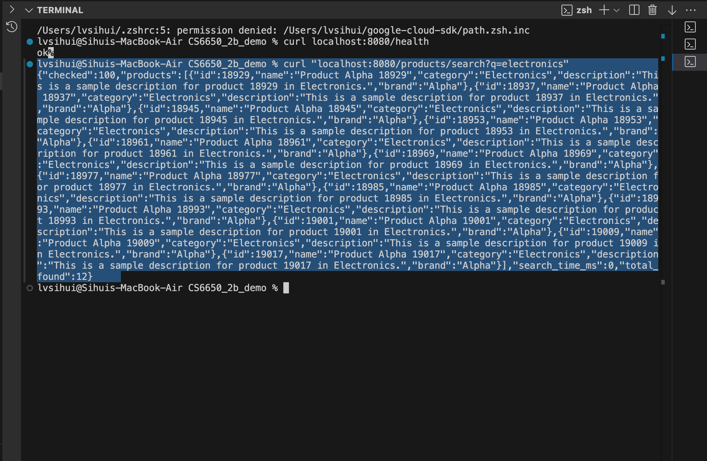
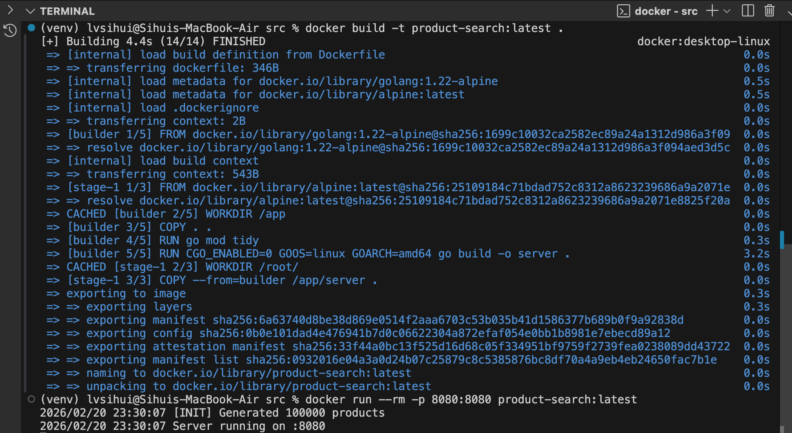
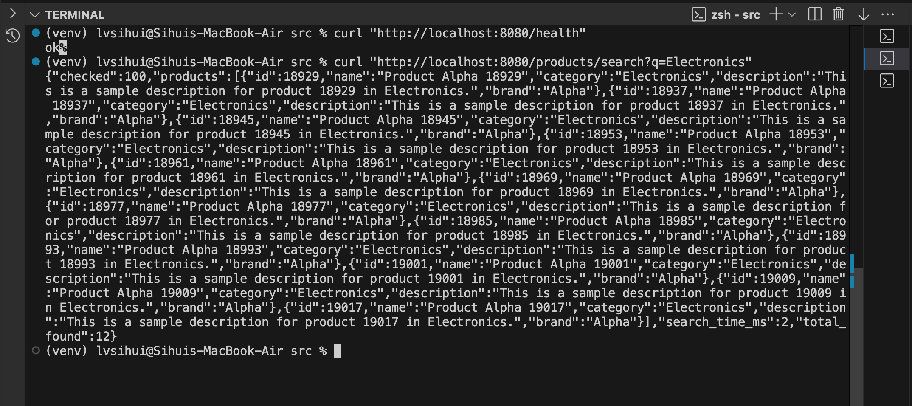
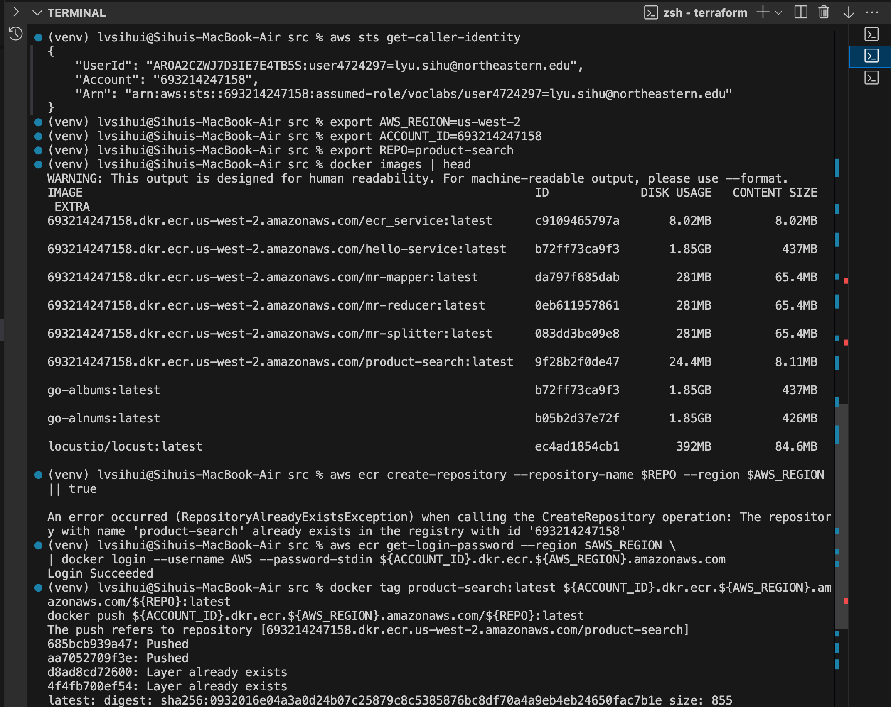

## Load Testing Setup

- Tool: Locust
- Target host: http://54.189.176.71:8080
- Infrastructure: ECS Fargate deployment
- Test strategy: gradually increase concurrent users

Test levels:

- 50 users
- 100 users
- 1000 users
- 5000 users

---

## Results

### 50 Users

Observation:

- Low latency (~40ms)
- Stable RPS (~1200)
- No failures
- System underutilized

---

### 100 Users

Observation:

- Slight latency increase (~47ms)
- Higher throughput (~1900 RPS)
- Still stable
- No failures

---

### 1000 Users

Observation:

- Latency increased (~233ms)
- Throughput increased (~2700 RPS)
- System still functional
- Beginning of saturation

---

### 5000 Users (Peak Load)

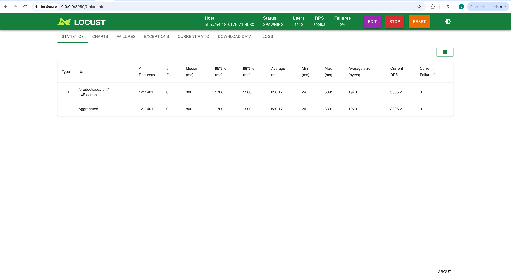

Observation:

- Latency significantly increased (~830ms)
- Throughput plateau (~3000 RPS)
- No explicit failures
- System reached performance bottleneck

---

## Infrastructure Metrics

### CPU and Memory Utilization

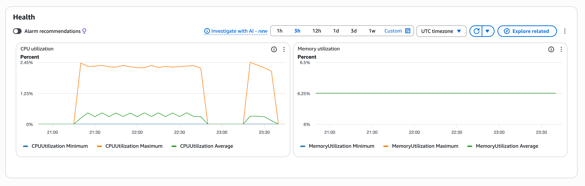
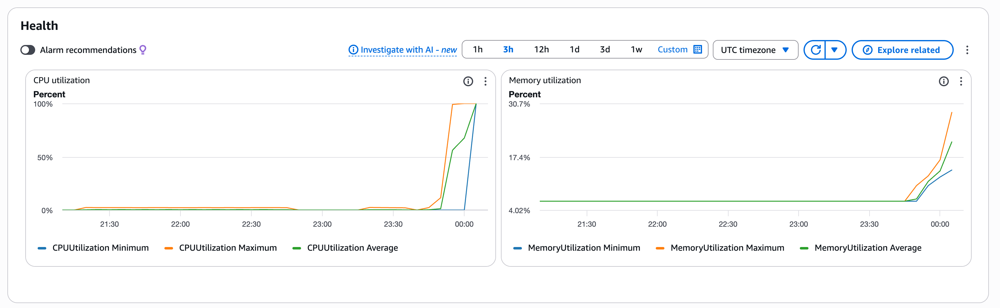

Observation:

- CPU reached 100% utilization
- Memory utilization increased significantly
- Indicates compute-bound bottleneck

---

## Analysis

The experiment shows typical scalability behavior:

- Throughput increases with load initially
- Latency increases gradually
- Eventually throughput plateaus
- CPU saturation becomes bottleneck

Even without request failures, system degradation is observable via:

- Increased response time
- CPU saturation
- Throughput flattening

This indicates the system reached its maximum capacity.

---

## Conclusion

The Product API demonstrates horizontal scalability up to moderate load levels.
Under extreme load (5000 users), the ECS task becomes CPU-bound, resulting in increased latency and throughput saturation.

This experiment validates expected system behavior under stress and highlights the importance of autoscaling for production deployments.

# Part III: Horizontal Scaling with Auto Scaling

## System Setup

An Application Load Balancer (ALB) was introduced to enable horizontal scaling of the product search service deployed on Amazon ECS Fargate.

The ALB acts as the entry point and distributes requests across multiple service tasks registered in a target group. Health checks ensure that only healthy tasks receive traffic.

### Key configuration

**Load Balancer**

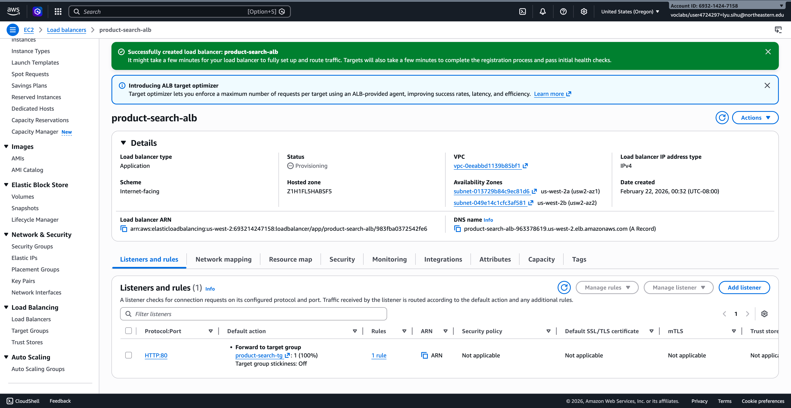

- Listener: HTTP:80
- Target type: IP (Fargate requirement)
- Container port: 8080
- Health check path: `/health`

**ECS Service**

- Launch type: Fargate
- Scheduling strategy: Replica
- Baseline capacity: 2 tasks
- Rolling deployment

**Service Auto Scaling**

- Metric: ECSServiceAverageCPUUtilization
- Baseline target: 70%
- Min tasks: 2
- Max tasks: 4

This setup enables dynamic capacity adjustment without modifying application logic.

---

## Experiment 1 – Baseline Horizontal Scaling

Low load test with fixed capacity.

### user50

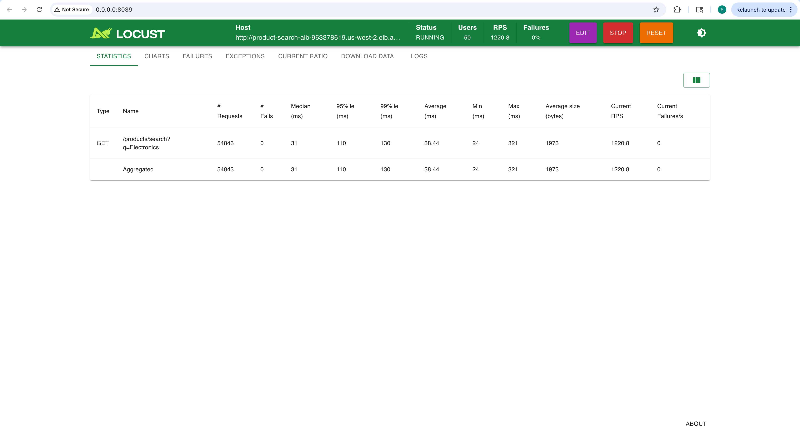
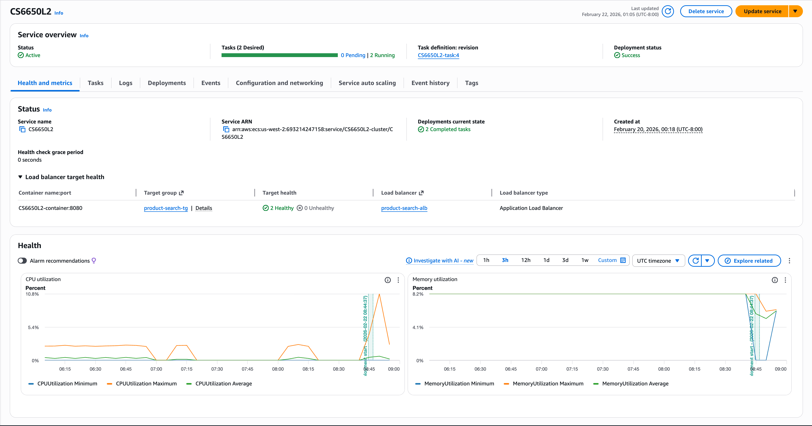
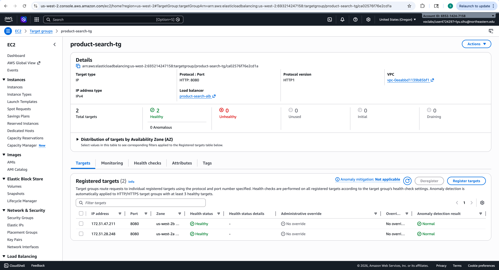
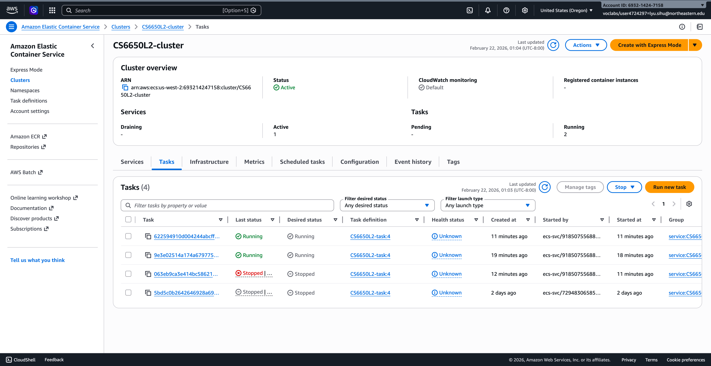

### user100

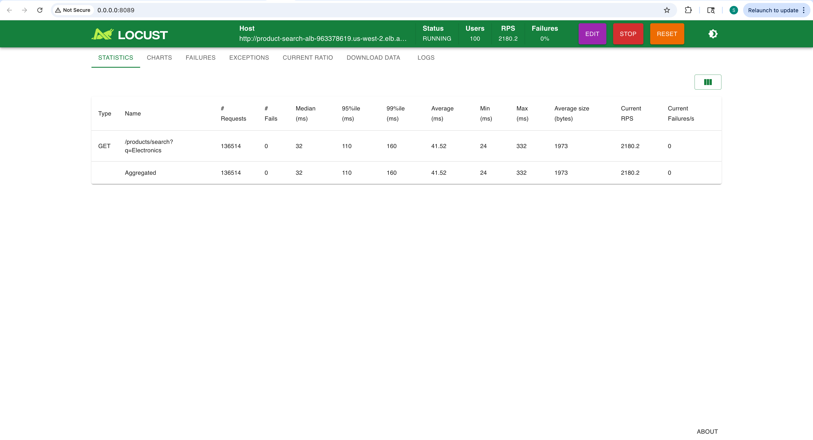
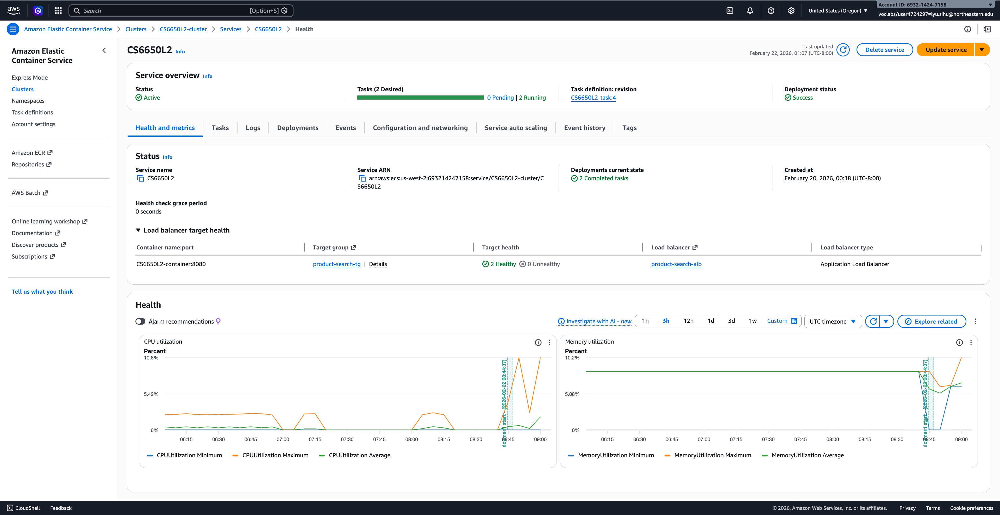

### user1000

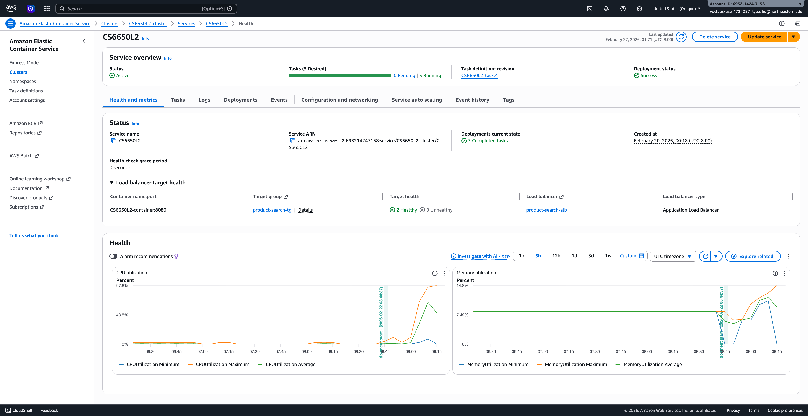

### Observations

- CPU utilization increased with workload
- Service operated with baseline capacity
- No scaling triggered under moderate load
- System remained stable
- Additionally, a reduction in average response time compared to Part II was observed under similar workloads. This improvement is attributed to reduced request queueing delay resulting from parallel processing across multiple tasks rather than per-request execution speedup.

This confirms correct baseline operation of the horizontally distributed architecture.

---

## Experiment 2 – Deterministic Scaling Validation

To validate scaling behavior independently of workload variability, the target CPU threshold was temporarily lowered to 40%.

A moderate load test (approximately 1000 users) was executed.

### Observations

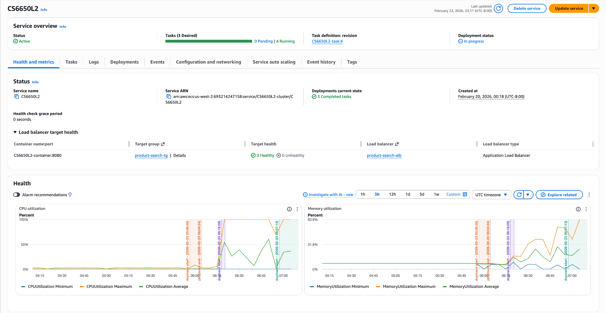

- Rapid increase in average CPU utilization relative to threshold
- ECS service launched additional tasks
- Target group healthy target count increased
- Scaling lifecycle observed (running → initial → healthy)

This controlled experiment confirms that scaling policy configuration directly influences capacity adjustment behavior.

---

## Experiment 3 – Resilience / Failure Injection Test

During an active load test, a running task was manually stopped to simulate instance failure.

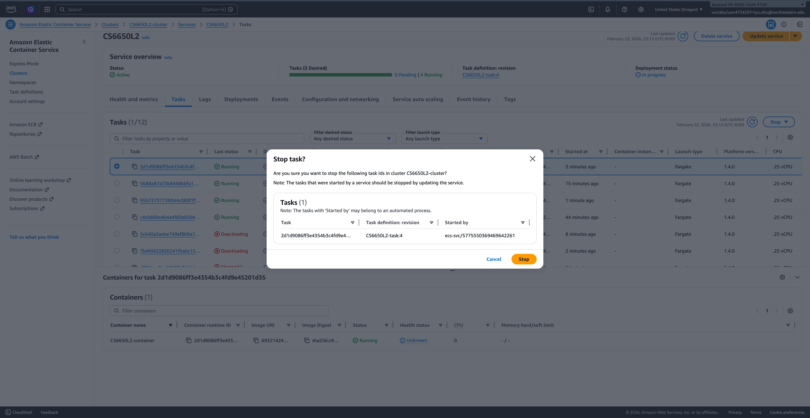

### Observations

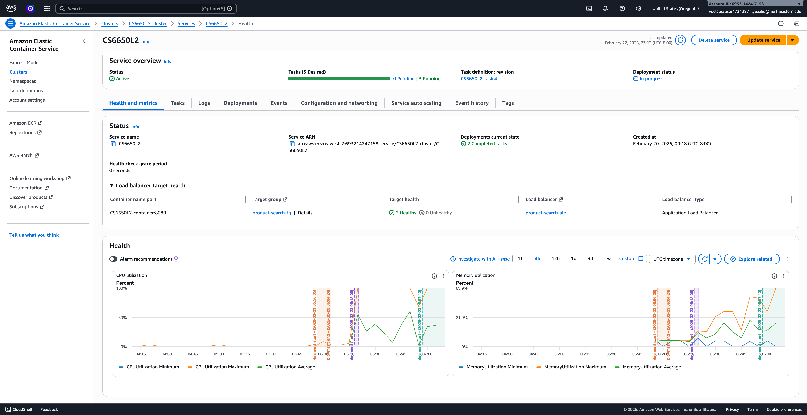

- The stopped task entered draining state
- Remaining tasks continued serving requests
- No visible service outage occurred
- ECS automatically maintained desired capacity
- Load balancer routed traffic only to healthy targets

This experiment demonstrates the resilience benefits of horizontal scaling, where individual instance failures do not disrupt system availability.

---

## Variability Across Repeated Experiments

Repeated experiments with identical user loads produced different scaling outcomes.

For example, in some runs, scaling occurred at approximately 1000 users, while in others it did not.

This behavior is expected due to several factors:

- Stochastic request distribution by the load balancer
- Scaling decisions based on average CPU rather than user count
- Runtime warm-state effects (connection reuse, caching)
- Client-side load generation variability affecting effective throughput

These observations highlight that horizontally scaled distributed systems exhibit probabilistic rather than deterministic performance characteristics.

---

## Trade-off Analysis: Horizontal vs Vertical Scaling

### Horizontal Scaling Advantages

- Improved availability through redundancy
- Fault tolerance against instance failure
- Elastic capacity adjustment
- Load distribution across instances

### Horizontal Scaling Challenges

- Increased infrastructure complexity
- Metric-driven scaling variability
- Load balancing overhead
- Potential consistency considerations in stateful systems

Compared to vertical scaling, horizontal scaling provides stronger resilience and elasticity, making it foundational to modern distributed system design.

---

## Scaling Behavior Prediction

Based on experimental observations:

- Sudden load spikes trigger delayed but automatic scaling due to metric smoothing
- Gradual load increases result in smoother scaling transitions
- High thresholds reduce scaling sensitivity
- Lower thresholds increase responsiveness but may cause over-provisioning

These behaviors align with expected target-tracking auto scaling dynamics.

---

## Conclusion

The horizontally scalable architecture successfully resolved the performance limitations identified in Part II. By introducing an Application Load Balancer, dynamic target registration, and CPU-based auto scaling, the system demonstrated elastic capacity growth, resilience to instance failure, and stable request handling under increased load.

The experiments also revealed inherent variability in scaling behavior, reinforcing key distributed systems concepts such as probabilistic load distribution and metric-driven elasticity.
